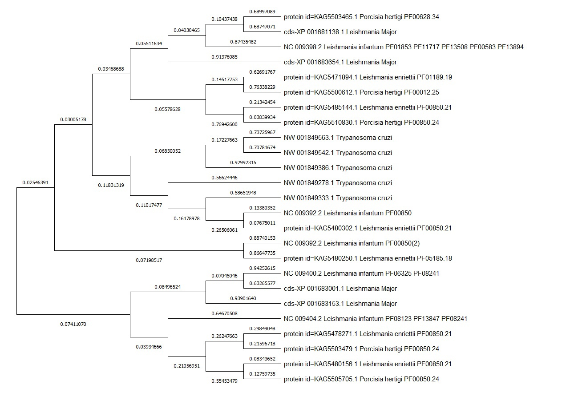

# Репозиторий 10-ой группы

## Презентации

Вводная презентация: https://docs.google.com/presentation/d/1-YkXLfHtL4LDpEVJ76qGs1vTH0EWD6xJmTLPb8fjkcU/edit?usp=sharing  
Финальная презентация: https://docs.google.com/presentation/d/1zaJPzb0W_asJw71HVA9b8TosT4vW8EiWDizZHImSRko/edit?usp=sharing  

## Деревья

Все построения и выравнивания были произведены с помощью программы `Mega`.  
Для построения выравниваний использовался алгоритм `Muscle multi alignment`.  
Для построения деревьев использовался алгоритм `Maximum likelihood estimation`.  

Построенное дерево для генов, отвечающих за эпигенетику.  

Построенное дерево для генов, в промоторах которых есть квадруплексы/Z-DNA.  
Для консервативности были выбраны гены процессинга рРНК, в промоторы которых попали все вторичные структуры.  

